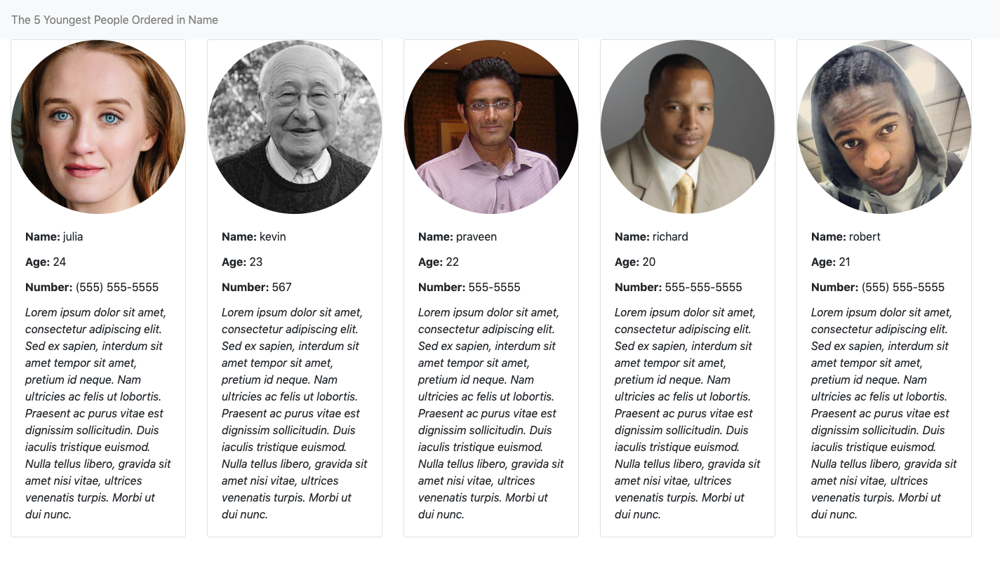

# AppSheet Exercise Project
### What Does This Project Do
This is a simple web service that read dummy people data from the service endpoint
and display the 5 youngest users with valid us telephone number sorted by name.

### Environment Setup
* [Java JDK 8+](https://www.oracle.com/technetwork/java/javase/downloads/index.html)
* [Spring Boot Maven Plugin Reference Guide](https://docs.spring.io/spring-boot/docs/2.1.9.RELEASE/maven-plugin/)
* [Spring Web](https://docs.spring.io/spring-boot/docs/2.1.9.RELEASE/reference/htmlsingle/#boot-features-developing-web-applications)

### Running From Commandline
mvn clean spring-boot:run

### Running unit tests
mvn clean test

### Project Demo

